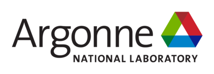



<!-- -->

 

FZ is a modular, parametrizable lossy compressor framework designed for scientific data, including both floating point numbers and integers. It is applicable in fields such as simulations, AI, and instrumentation. Not only is FZ a production-quality software, but it also serves as a research platform for lossy compression. The framework is both open and transparent. It's "open" in that all interested researchers and students can study or contribute to it, and "transparent" in the sense that all performance improvements are detailed in publications.




<!-- {}
Goldydocs provides a single web UI providing visibility into porridge
temperature, chair size, and bed softness metrics! You can even find out who's
been eating **your** porridge.

(Sadly, Goldydocs isn't a real project, but you can use this site as an example
to create your own real websites with [Docsy](https://docsy.dev))
{} -->

<!-- {}
{}
The Goldydocs UI now shows chair size metrics by default.

Please follow this space for updates!
{}

{}
We do a [Pull Request](https://github.com/google/docsy-example/pulls) contributions workflow on **GitHub**. New users are always welcome!
{}

{}
For announcement of latest features etc.
{}

{} -->

{}
<h1 style="text-align:center;">We are working with the following institutions.</h1>
 

{}

<!-- {}

{}
Get the Goldydocs app!
{}

{}
We do a [Pull Request](https://github.com/google/docsy-example/pulls)
contributions workflow on **GitHub**. New users are always welcome!
{}

{}
For announcement of latest features etc.
{}

{} -->

<!-- {}
This is the another section
{.h1 .text-center}
{} -->
