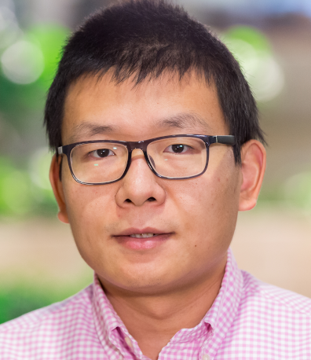
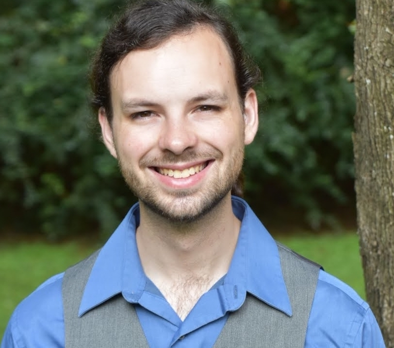
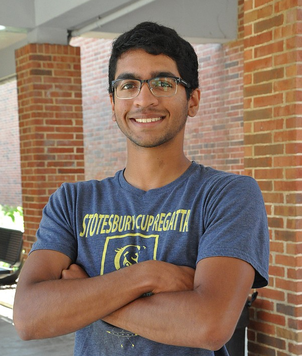
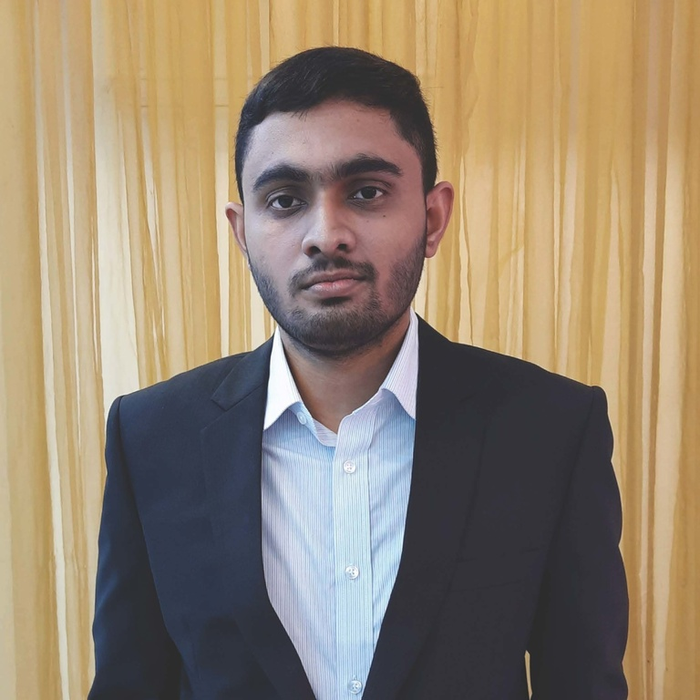
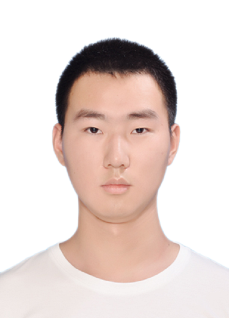

{}

Meet the team that leads FZ Development
{.mt-5}

{}

{}

SZ4 is developed by researchers from the University of Chicago, Indiana University, University of Alabama, and Ohio State University.
We work together with researcher all over the world to build the most advanced lossy compression library.

{}

{}

# Principle Investigators
{.text-center}

{}

<a style="font-size: 30px;" href="https://www.anl.gov/profile/franck-cappello" target="_blank">Franck Cappello</a>

  
  
Franck Cappello is the director of the Joint-Laboratory on Extreme Scale Computing gathering six of the leading high-performance computing institutions in the world. He is a senior computer scientist at Argonne National Laboratory and an adjunct associate professor in the Department of Computer Science at the University of Illinois at Urbana-Champaign. He is an expert in resilience and fault tolerance for scientific computing and data analytics. Recently he started investigating lossy compression for scientific datasets to respond to the pressing needs of scientist performing large-scale simulations and experiments. His contribution to this domain is one of the best lossy compressors for scientific datasets respecting user-set error bounds. He is a member of the editorial board of the IEEE Transactions on Parallel and Distributed Computing and of the ACM HPDC and IEEE CCGRID steering committees. He is a fellow of the IEEE.
  

<a style="font-size: 30px;" href="https://www.mcs.anl.gov/~shdi/" target="_blank">Sheng Di</a>

  
  
Dr. Sheng Di is a computer scientist at Argonne National Laboratory, USA. He received his Ph.D degree from The University of Hong Kong. He is an IEEE senior member. He is a scientist at Large through the Consortium for Advanced Science and Engineering (CASE) at the University of Chicago, and also an institute fellow of Northwestern-Argonne Institute of Science and Engineering (NAISE). Dr. Di's research interests include high performance computing, distributed computing, cloud computing, lossy compression, fault tolerance, etc. Dr. Di published 150+ papers in prestigious conferences and journals, including SC, ICS, HPDC, PPoPP, ICDCS, VLDB, ICDE, DSN, IPDPS, etc. He is the DOE 2021 Early Career Research Program Award Winner, and also the recipient of 2018 IEEE Chicago Section Distinguished Mentoring Award and 2019 IEEE Chicago Section Distinguished Research and Development Award. Dr. Di is the winner of the 2019 R&D100 award and 2021 R&D100 award.

<a style="font-size: 30px;" href="https://www.dingwentao.com/" target="_blank">Dingwen Tao</a>

  
  
Dingwen Tao is an Associate Professor at Indiana University Bloomington, where he directs the High-Performance Data Analytics and Computing Lab. He received his Ph.D. in Computer Science from the University of California, Riverside in 2018 and his B.S. in Mathematics from the University of Science and Technology of China in 2013. His research interests include high-performance computing (HPC), parallel and distributed systems, scientific data reduction and management, large-scale machine learning systems, and fault tolerance and resilience. He is the recipient of various awards, including the NSF CAREER Award (2023), Amazon Research Award (2022), Meta Research Award (2022), R&D100 Awards Winner (2021), IEEE Computer Society TCHPC Early Career Researchers Award for Excellence in HPC (2020), NSF CRII Award (2020), and the IEEE CLUSTER Best Paper Award (2018). He serves on the Technical Review Board of IEEE Transactions on Parallel and Distributed Systems. He served as the Program Co-chair of IEEE ScalCom-2021, the ACM/IEEE DRBSD-9 workshop, and the IEEE IWBDR workshops. Additionally, he acts as a reviewer, program committee member, or session chair for major HPC venues such as SC, HPDC, ICS, IPDPS, CLUSTER, ICPP, CCGrid, and HiPC.

<a style="font-size: 30px;" href="https://ayzk.github.io/" target="_blank">Kai Zhao</a>

  
  
Dr. Kai Zhao is a tenure-track assistant professor in the Department of Computer Science at Florida State University. He received his Ph.D. from University of California, Riverside in 2022 and his B.S. from Peking University in 2014. He received the Dean’s Distinguished Fellowship (2017), the Dissertation Year Program Fellowship (2021), and the Laxmi N. Bhuyan Fellowship (2021) from University of California, Riverside. His research interests include scientific data management, reduction, and analytics, and fault-tolerant computing. He is one of the key developers and researchers of the SZ lossy compression software which won the 2021 R&D 100 Award. He has published more than 20 papers in prestigious conferences and journals, including SC, HPDC, PPoPP, VLDB, ICDE, ACM ICS, PACT, and TPDS.

<a style="font-size: 30px;" href="https://hguo.github.io/" target="_blank">Hanqi Guo</a>

  
  
Dr. Hanqi Guo is an Associate Professor at the Department of Computer Science and Engineering at The Ohio State University, and he also holds a joint appointment at the Mathematics and Computer Science Division at Argonne National Laboratory.  His research interests include visualization, analysis, and machine learning for large-scale scientific data.  He is an awardee of the Department of Energy (DOE) Early Career Research Program (ECRP) in 2022 and received multiple best paper awards in premiere visualization conferences.

 
{}

# Post-Doctoral Researchers
{.text-center}

{}
<a style="font-size: 30px;" href="https://robertu94.github.io" target="_blank">Robert Underwood</a>

  
  
Robert Underwood is a Post Doctoral Appointee in the Mathematics and Computer Science Division at Argonne National Laboratory focusing on using data compression to accelerate I/O for large-scale scientific applications including AI for Science.    His library LibPressio, which allows users to experiment and adopt advanced compressors quickly, has over 200 average unique monthly downloads, is used in over 17 institutions worldwide, and is a contributor to the R&D100 winning SZ family of compressors and other compression libraries.  He regularly mentors students and is the early career ambassador for Argonne to the Joint Laboratory for Extreme Scale Computing.

 
{}

# Graduate Students
{.text-center}

{}

 

  

    
    <h5 style="width:150px;align-self:center">Jiannan Tian</h5>
  

  

    
    <h5 style="width:150px;align-self:center">Boyuan Zhang</h5>
  

  

    
    <h5 style="width:150px;align-self:center">Jinyang Liu</h5>
  

  

    
    <h5 style="width:150px;align-self:center">Yafan Huang</h5>
  

  

    
    <h5 style="width:150px;align-self:center">Milan Shah</h5>
  

  

    
    <h5 style="width:150px;align-self:center">Md Hasanur Rahman</h5>
  

  

    
    <h5 style="width:150px;align-self:center">Longtao Zhang</h5>
  

<!-- {}

 
# TODO

{} -->
